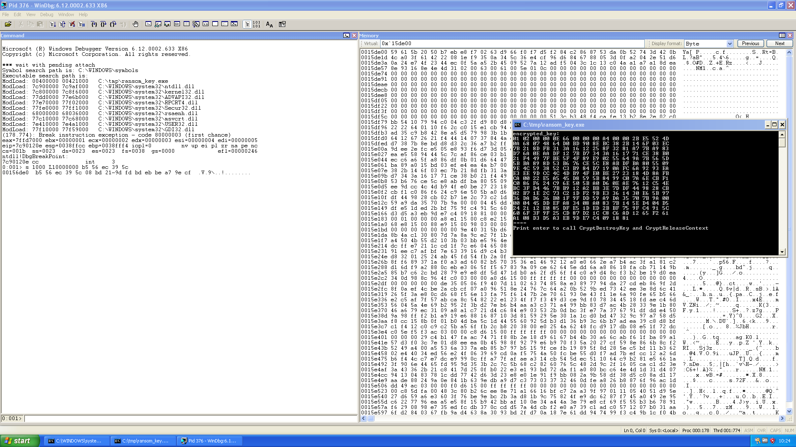
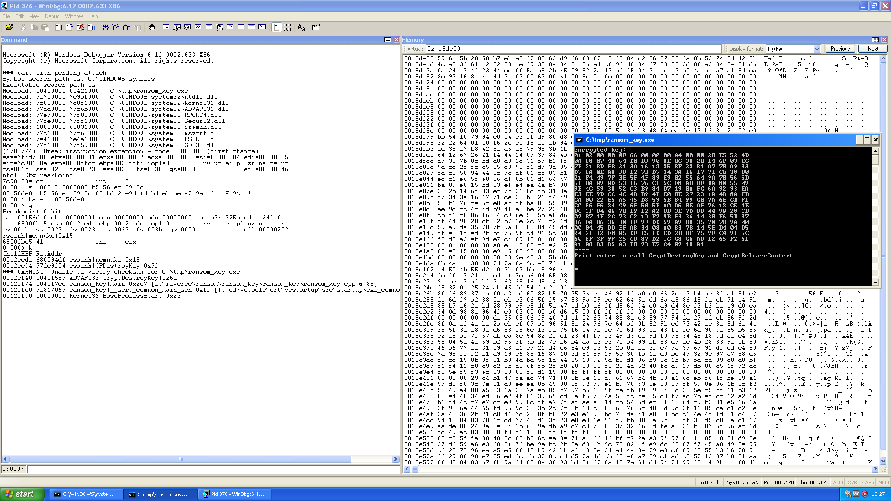
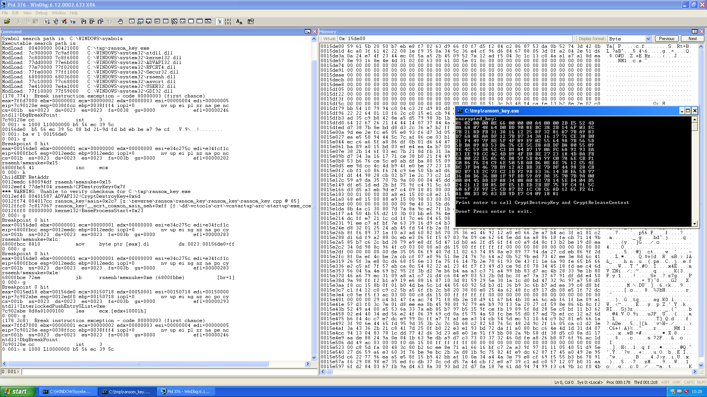

Petya 2017 reversing notes
==========================

DISCLAMER/WARNING
-----------------

These notes relate facts that have been found while reversing a sample of the
Z017 so called "Petya" (NotPetya?) malware. The sample is a DLL. Signatures of
this DLL:

* MD5: ``71b6a493388e7d0b40c83ce903bc6b04``
* SHA1: ``34f917aaba5684fbe56d3c57d48ef2a1aa7cf06d``
* SHA256: ``027cc450ef5f8c5f653329641ec1fed91f694e0d229928963b30f6b0d7d3a745``

We tried as much as possible to double check what is stated here, but we might
have missed some things. Please note that this is still work in progress.

Part of the work on retrieving the bootloader has been done by lafouine.

TL;DR
-----

Cryptographic high level view:

* There are actually two ransoms.
* First encryption process (before rebooting): the first megabyte of files with
  specific extensions are encrypted with the same random AES key in CBC mode. This
  key is encrypted with a static public RSA key, and the result is saved on
  disk in a "ransom" file.  We didn't find so far a way to recover this AES key.
* Bootloader: if the process has the appropriate rights and if the system isn't
  using UEFI, sector 0-18 of the hard drive are overwritten with a custom
  bootloader. Sector 32-34 are overwritten with other data (see below) 
* The system then reboots using the undocumented API ``NtRaiseHardError``. If
  this API isn't available, it will use classical APIs to do so.
* Second "encryption" process (by the bootloader, post reboot): we haven't fully
  reversed this yet so we won't claim anything, although it seems there are
  similarities with what is described here:
  http://blog.checkpoint.com/2016/04/11/decrypting-the-petya-ransomware/. The
  effects is that the structure of the NTFS filesystem **seems** broken,
  although the file contents **seems** to be still there. We don't know yet whether
  this process is destructive or not.

For now, we don't have any way to decrypt any of the two encryption processes.

Bootstrap
---------

The Petya DLL exports only one external symbol. We don't have the binary that
dropped this DLL, but we guess this is loading it and calling this symbol.

The Petya DLL runs several threads. We only checked the ones related to the
cryptographic scheme and the writing of the bootloader.

We will now detail the various encryption processes and what we have on the bootloader.

Encryption process 1 (pre-reboot)
---------------------------------
 
The DLL looks for files whose extension is one of these: 3ds, 7z, accdb, ai,
asp, aspx, avhd, back, bak, c, cfg, conf, cpp, cs, ctl, dbf, disk, djvu, doc,
docx, dwg, eml, fdb, gz, h, hdd, kdbx, mail, mdb, msg, nrg, ora, ost, ova, ovf,
pdf, php, pmf, ppt, pptx, pst, pvi, py, pyc, rar, rtf, sln, sql, tar, vbox,
vbs, vcb, vdi, vfd, vmc, vmdk, vmsd, vmx, vsdx, vsv, work, xls, xlsx, xvd, zip.

These files are encrypted with the same randomly generated AES 128 key, which
is created using ``CryptGenKey``. The CBC mode is used, with an IV which seems
to be of 16 null bytes (this still needs to be confirmed). One thing to notice
is that only the first megabyte (as in 1048576 bytes) is encrypted.  Encryption
happens using ``CryptEncrypt``. If the file is less than 1MB, it is thus fully
encrypted. See above in the pseudo-code for some notes about padding. After
this encryption process is done, the AES key is encrypted with a static public
2048-bit RSA key embedded in the DLL, using ``CryptExportKey``. It is then
written in base64 in the file
``C:\Users\$user\AppData\VirtualStore\README.txt`` or ``C:\README.txt``,
depending on the rights the ransomware process has.  Here is an example of such file::

    Ooops, your important files are encrypted.
    
    If you see this text, then your files are no longer accessible, because
    they have been encrypted. Perhaps you are busy looking for a way to recover
    your files, but don't waste your time. Nobody can recover your files without
    our decryption service.
    
    We guarantee that you can recover all your files safely and easily.
    All you need to do is submit the payment and purchase the decryption key.
    
    Please follow the instructions:
    
    1.	Send $300 worth of Bitcoin to following address:
    
    1Mz7153HMuxXTuR2R1t78mGSdzaAtNbBWX
    
    2.	Send your Bitcoin wallet ID and personal installation key to e-mail wowsmith123456@posteo.net.
    	Your personal installation key:
    
    AQIAAA5mAAAApAAAGWjeb2N8C9dmtl1Uqim1hy2D7jwAjFcUSJXX9mn7YVQNDV7Z
    2qe/rd5+dEzoeYPbN1ydvI2PlTx4I157cmLfjt88hlmZtt2AnvhPZnOXsmOurZdJ
    cYgXGkilzF01j4WJ9TFz9z/74zronmTlK2YvZB05p24SHDyYpbdzKBF5FqAFASBY
    y9K+axHlqmJy07vzl2husut9JAtn5ZULGyOoXry6FCeo8P6wgCktzJsig1J0hAIZ
    3yY3/slnH27MZEUqWSDcCO16gNM6spKGyXxnuYdDJWR1bmg6iKfuuo0Hx9oNUwkN
    uvrheoXbbseZQj4q75JHao62bODOVO34PARkAg==

The "installation" key here is indeed the encrypted AES key in base64.

This is the "first" ransom.

The public RSA key blob is in ``public_key/rsa_public_key``. A "decoded" version is in ``public_key/rsa_public_key.txt``.

Here is a pseudo (C) code of what's happening here (function APIs have been
changed and error tests have been removed for the sake of clarity):

.. code:: c

    // Based on function Ox10001E51
    void thread_encrypt() {
      ...
      HCRYPTKEY aesKey;
      HCRYPTPROV hProv = [generate cryptographic context using CryptAcquireContext];
      aesKey = genKey(hProv);
      cryptFiles(hProv, aesKey);
      finalize(aesKey);
      CryptDestroyKey(aesKey);
      CryptReleaseContext(hProv, 0);
    }

    // Based on function Ox10001B4E
    HCRYPTKEY genKey(hProv) {
      HCRYPTKEY Ret;
      CryptGenKey(hProv, CALG_AES_128, 1u, &Ret);
      DWORD mode = CRYPT_MODE_CBC;
      CryptSetKeyParam(Ret, KP_MODE, &mode, 0);
      DWORD pad = PKCS5_PADDING;
      CryptSetKeyParam(Ret, KP_PADDING, &pad, 0);
      return Ret;
    }

    // Based on function Ox10001973
    void cryptFiles(hProv, aesKey) {
      for every file candidate F:
        cryptFile(hProv, aesKey);
    }

    // Based on function 0x1000189A
    void cryptFile(hProv, aesKey, Path) {
      // Get handle to Path
      HANDLE hFile = CreateFile(...);
      uint64_t size;
      // This is not the exact Windows API, but this makes the explanation easier...
      GetFileSizeEx(hFile, &size);
      bool final; 
      // Compute encryption size
      if (size <= 0x100000) {
         // Here, the next multiple of 16 of Size is computed. Indeed, when the
         // file is less than 1MB, CryptEncrypt this will use PKCS5 padding for
         // the last block. Our file will be thus at most one 16 byte block larger.
         size = ((size/16) + 1)*16;
         final = TRUE;
      }
      else {
        // If we have 1MB of data to encrypt, then the Final is set to FALSE.
        // Indeed, CryptEncrypt will *always* add a final padding block, even if
        // the size of the data to encrypt is a multiple of 16. In this case, if
        // it has set the Final flag to TRUE, 16 bytes would have been overwritten
        // in the original file (as encryption is done in-place, see above),
        // with no chance of retrieving them.
        final = FALSE;
      }
      // MemoryMap isn't a Windows API. This is basically just to say that
      // only "size" bytes are memory mapped.
      void* buffer = MemoryMap(hFile, size);
      DWORD sizeEncrypted;
      CryptEncrypt(hProv, 0, final, buffer, &sizeEncrypted, size);
      // This makes sure that encrypted data are effectively written on the
      // hard disk.
      FlushViewOfFile(..);
      // Then close the memory map and the file.
    }

    // Based on function Ox10001D32
    void finalize(hProv, aesKey) {
      HCRYPTKEY rsaPubKey = getStaticRSAPubKey(hProv):
      void* keyEncryptedb64 = exportKey(aesKey, rsaPubKey);
      // and then write the ransom in the README.txt file, with the base64
      // encoded version of the encrypted AES key.
      [...]
      LocalFree(keyEncryptedb64);
    }

    void* exportKey(aesKey, rsaPubKey)
    {
      DWORD size;
      CryptExportKey(aesKey, rsaPubKey, SIMPLEBLOB, 0, 0, &size);
      void* buffer = LocalAlloc(0x40, size);
      CryptExportKey(aesKey, rsaPubKey, SIMPLEBLOB, 0, buffer, &size);
      DWORD b64size;
      CryptBinaryToStringW(buffer, size, CRYPT_STRING_BASE64, 0, &b64size);
      void* bufb64 = LocalAlloc(0x40, 2*b64size);
      CryptBinaryToStringW(buffer, size, CRYPT_STRING_BASE64, buf64, &b64size);
      LocalFree(buffer);
      return bufb64;
    }

    HCRYPTKEY getStaticRSAPubKey(hProv)
    {
      [...]
      // Basically calls:
      //   CryptDecodeObjectEx on a static buffer
      //   Give the result of this decoding process to CryptImportKey, with dwFlags = 0
      // This RSA key seems to have been generated by CryptGenKey (it has the
      // MS format of public RSA key exported with CryptExportKey).
      return rsaPubKey;
    }

AES key recovery attempts
*************************

We checked whether ``CryptDestroyKey`` and ``CryptReleaseContext`` indeed wiped
the AES key from memory. We did that because there are chances that the memory
isn't wiped by the BIOS after a soft reboot
(http://forensicswiki.org/wiki/Memory_Imaging).  Moreover, if the system is
configured to do so, ``NtRaiseHardError`` can create a full memory dump on disk
before rebooting
(https://support.microsoft.com/en-us/help/254649/overview-of-memory-dump-file-options-for-windows).
This is unfortunately not the default setting.

Unfortunately, at least on WinXP 32 bits and Win10 64 bits, ``CryptDestroyKey``
actually wipes the AES key from memory. Here are WinDbg screenshots that show
how and by whom the key is wipped from memory (using the test program
``aes_key/ransom_key``) (running under WinXP 32 bits):

Here, we can see that the AES key is still present in memory
(``CryptDestroyKey`` hasn't been called):

We set a breakpoint on the address we found, and run ``CryptDestroyKey``. We
can see above that the ``memnuke`` internal function is called on the buffer we found:

After ``CryptDestroyKey`` and ``CryptReleaseContext`` were run, we can see that
the key isn't in memory anymore:

See the ``aes_key`` directory for materials to reproduce this.

We encourage people to retry these experiments on other Windows variants, even
other similar idea! There might be other traces in memory that would lead to
the recovery of the AES key.

Bootloader rewriting
--------------------

As a recall for this section, a sector is defined as 512 bytes.

The bootloader is written by the function ``0x100014A9`` (that we'll call
``genMBR``), launched after the first encryption process. This is done only if
the system isn't using UEFI, and if the process has the proper rights to
overwrite the MBR.

This function overwrites the sector from 0 to 18 (inclusive) with code included
in the DLL. It then write the sector 32 with 40 random bytes and the
installation key, which is another random string. 
It writes the sector 33 with 512 bytes of value 0x7. The sector 34 is
overwritten with the original MBR xored with 0x7.

Reverse of the first stage of the bootloader
--------------------------------------------

This part has mainly been done by lafouine. Notes were written by myself.

The first thing the bootloader does is loading itself into memory. Indeed, only
the first sector (the MBR) is loaded by the BIOS into memory. It uses the ``int
0x13`` interruption with the register ``ah`` at ``0x42`` to read sectors from the disk
(https://en.wikipedia.org/wiki/INT_13H#INT_13h_AH.3D42h:_Extended_Read_Sectors_From_Drive).
The python script ``bootloader/remap_mbr.py`` simulates this and recreate a
file correctly "mapped" that can now be loaded into IDA. Be sure to rebase the
binary at the ``0x7C00`` address and disassemble it as 16 bit code.

The reversing of the crypto part of this bootloader is still WIP. Some
observations are noted below, but must only be considered as hypotheses and not
confirmed facts.

"Encryption" process 2 (post-reboot, bootloader)
------------------------------------------------

**Warning**: this section only contains **assumptions** based on observations when
infecting a virtual machine on purpose. This still needs confirmation by a
proper reverse engineering of the bootloader, and also based on previous work
on old variants of the malware.

When the machine reboots, the NTFS partition where Windows resides is still
mountable and readable. After the "fake" chkdsk has run, the partition can
still be mounted but the structure seems to be broken because no files can be
accessed. The files data are actually still there. This has been tested by
explicitely searching for a file content of a .txt written before infection
(cf. above, .txt files are not encrypted by the first encryption process).

Some reports say that only the ntfs mft section is encrypted. This seems to be
coherent with what we observe.

Moreover, the installation key shown by the bootloader is an encoded variant of
the 40 random bytes generated by the genMBR function above. It seems to be the
only input to the "encryption" process takes. **If this process isn't
destructive**, it seems raisonnable to think that it could be reserved, given
this installation key.

This assumption seems raisonnable as old variant of petya had been reversed and
a "keygen" had been produced
(http://blog.checkpoint.com/2016/04/11/decrypting-the-petya-ransomware/).

Note that even if this encryption process is "cracked", the first encryption
process still need to be reversed!

Credits
-------

* lafouine for his help
* Wine sources for the format of exported AES keys (https://github.com/wine-mirror/wine/blob/master/dlls/rsaenh/rsaenh.c#L2451)
