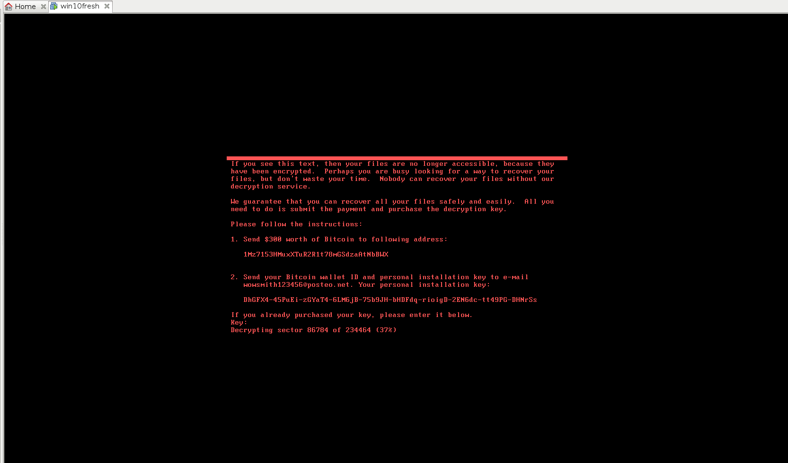

NotPetya in-memory bootloader key recovery
==========================================

Experiment
----------

This is an experiment to show that the 32-bytes salsa key that is wipped from
the disk by the Petya bootloader still resides in the bootloader memory and can
be used to force the bootloader to decrypt the MFT, provided we can read and
write the memory of the running computer.

Experiment is done here using VMware.

Steps to reproduce:

* manually infect a Windows virtual machine using NotPetya
* wait for the computer to reboot and for the red ransom message to appear
* take a snapshot of the virtual machine
* a file named ``/path/to/vm/XXX-Snapshot0.vmem`` should be present (N represent a number)
* shutdown the virtual machine
* use the ``path_mem.py`` python script: ``python2 ./patch_mem.py /path/to/vm/XXX-Snapshot0.vmem``
* restore the snapshot using VMware and press enter
* this should appear:

After that, the MFT is restored but the MBR still seems borken. Nevertheless,
the NTFS partition is now mountable (this can be verified with
``vmware-mount``). Please note that files are still encrypted by AES. You can
see the associated ransom in ``C:\README.txt``.

What next?
----------

DMA attacks might be possible using PCI Express or Firewire. This is something
that could be tried with a physical running machine that has one of these
interfaces!
